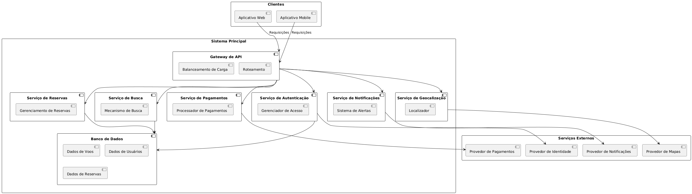

# Atividade ponderada de Programação | Semana 4 | SOA

**Estudante**: Nataly de Souza Cunha | T11 | G04

**Professor(a)**: Ovidio Lopes da Cruz Netto

## 🎯 Atividade

&emsp;Elaboração de uma arquitetura orientada a serviços para uma companhia aérea, visando intercomunicação de componentes independentes.

## Arquitetura

&emsp;O desenho da arquitetura foi feito na plataforma online [PlantUML](https://plantuml.mseiche.de/), comumente utilizada para a elaboração de diagramas UML, e pretende garantir viabilidade prática, modularidade, escalabilidade e facilidade de integração com sistemas externos.

<div align="center">
  <sub>Figura 1 - Arquitetura companhia aérea </sub> <br>

  

  <sup>Fonte: Material produzido pelo autor (2025).</sup>
</div>

```
<!-- Código do PlantUML que gera o diagrama -->
@startuml ArquiteturaSistemaReservasVoos

skinparam componentStyle uml2
skinparam nodesep 20
skinparam ranksep 20

' --- Componentes Principais ---
rectangle "Clientes" as clientes {
  component "Aplicativo Web" as web
  component "Aplicativo Mobile" as mobile
}

rectangle "Sistema Principal" as sistema {
  component "Gateway de API" as gateway {
    [Balanceamento de Carga]
    [Roteamento]
  }

  component "Serviço de Reservas" as reservas {
    [Gerenciamento de Reservas]
  }

  component "Serviço de Busca" as busca {
    [Mecanismo de Busca]
  }

  component "Serviço de Pagamentos" as pagamentos {
    [Processador de Pagamentos]
  }

  component "Serviço de Notificações" as notificacoes {
    [Sistema de Alertas]
  }

  component "Serviço de Geocalização" as geolocalizacao {
    [Localizador]
  }

  component "Serviço de Autenticação" as autenticacao {
    [Gerenciador de Acesso]
  }

  component "Banco de Dados" as database {
    [Dados de Voos]
    [Dados de Usuários]
    [Dados de Reservas]
  }
}

rectangle "Serviços Externos" as externos {
  component "Provedor de Pagamentos" as provedor_pagamentos
  component "Provedor de Notificações" as provedor_notificacoes
  component "Provedor de Mapas" as provedor_mapas
  component "Provedor de Identidade" as provedor_identidade
}

' --- Conexões ---
web --> gateway : "Requisições"
mobile --> gateway : "Requisições"

gateway --> reservas
gateway --> busca
gateway --> pagamentos
gateway --> notificacoes
gateway --> geolocalizacao
gateway --> autenticacao

reservas --> database
busca --> database
autenticacao --> database

pagamentos --> provedor_pagamentos
notificacoes --> provedor_notificacoes
geolocalizacao --> provedor_mapas
autenticacao --> provedor_identidade

@enduml 
```

#### A. Interação com o usuário (Frontend)
- **Aplicativo Web ou Mobile**:
  - Oferece interfaces para usuários finais, sejam eles clientes que farão a busca e reserva de vôos (entre outras atividades, como a visualização dos próprios dados de cadastro, por exemplo), ou funcionários que farão o gerenciamento administrativo da companhia aérea, também visualizando voos, disponibilidade de assentos e informações do cliente.
  - **Justificativa**: Separação clara entre frontend e o restante do sistema, permitindo evoluções independentes da interface, como a troca de frameworks e linguagens, bem como manutenções pontuais do código.

#### B. Gateway de API
- Balanceamento de carga e roteamento de requisições
- **Justificativa**:
  - Ponto único de entrada para todos os serviços;
  - Implementa segurança centralizada (rate limiting, autenticação).

#### C. Serviços de Negócio (Core Services)

| Serviço             | Responsabilidade                     | Benefício                     |
|---------------------|-------------------------------------|-----------------------------------|
| Reservas           | Gerencia reservas e regras de negócio | Isola a lógica central do sistema |
| Busca              | Consulta voos com filtros            | Permite otimizações independentes |
| Pagamentos         | Processa transações financeiras      | Segrega dados sensíveis           |
| Notificações       | Envia e-mails/SMS de confirmação     | Reutilizável para outros fluxos   |
| Geolocalização     | Detecta aeroportos próximos          | Melhora UX sem acoplamento        |
| Autenticação       | Gerencia login e autorização         | Centraliza segurança de funcionalidades com base no papel de cada usuário (cliente, funcionário, etc.)             |

#### D. Banco de Dados
- Armazena dados de voos, usuários e reservas
- **Justificativa**:
  - Pode evoluir com aprimoramento de linguagens, frameworks ou manutenções;
  - Garante consistência transacional.

#### E. Serviços Externos
- **Provedores de Pagamento, Notificação, Mapas e Identidade**
- **Justificativa**:
  - Reduz custos de desenvolvimento
  - Permite troca de provedores sem impacto no núcleo

## Requisitos Não-Funcionais (RNFs)

### 1. Tempo de Resposta em Buscas
- **Especificação**: 
  > Retornar resultados de busca em ≤ 1,5s para 95% das requisições (10.000 usuários simultâneos)
- **Métrica**: P95 do tempo de resposta
- **Monitoramento**: APM (New Relic/Dynatrace)
- **Solução**: Cache (Redis) + balanceamento de carga

### 2. Disponibilidade do Gateway
- **Especificação**:
  > 99,99% de disponibilidade (≤52min downtime/ano)
- **Métrica**: SLA via Prometheus/Grafana
- **Solução**: Redundância em múltiplas zonas

### 3. Segurança de Pagamentos
- **Especificação**:
  > Conformidade PCI DSS Level 1 com criptografia AES-256
- **Métrica**: Certificação + auditorias trimestrais
- **Solução**: Isolamento em VPC + TLS 1.3

### 4. Escalabilidade de Reservas
- **Especificação**:
  > Processar ≥500 TPS durante picos (auto-scaling ≥80% CPU)
- **Métrica**: Transações por segundo (CloudWatch)
- **Solução**: Filas (SQS) + containers escaláveis

### 5. Latência em Notificações
- **Especificação**:
  > Enviar confirmações em ≤30s após pagamento (≥99,5% delivery)
- **Métrica**: Logs de provedores (SendGrid/Twilio)
- **Solução**: Filas prioritárias (RabbitMQ)

## Tabela de Monitoramento

| RNF               | Ferramentas               | Ações de Mitigação           |
|-------------------|--------------------------|-----------------------------|
| Tempo de Busca    | New Relic, Dynatrace      | Otimização de queries       |
| Disponibilidade   | Prometheus + Grafana      | Health checks automáticos   |
| Segurança         | Qualys, Nessus           | Pentests regulares          |
| Escalabilidade    | Kubernetes HPA           | Micro-batches               |
| Notificações      | Logs de provedores       | Retry automático            |